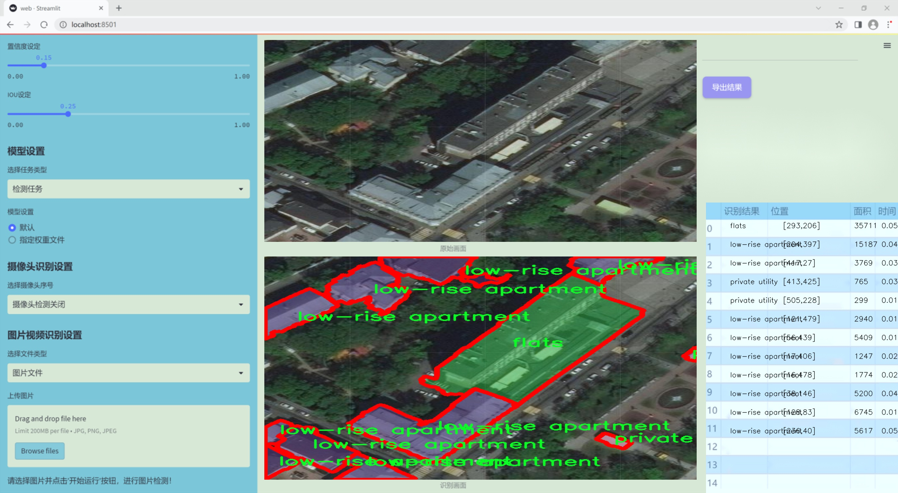
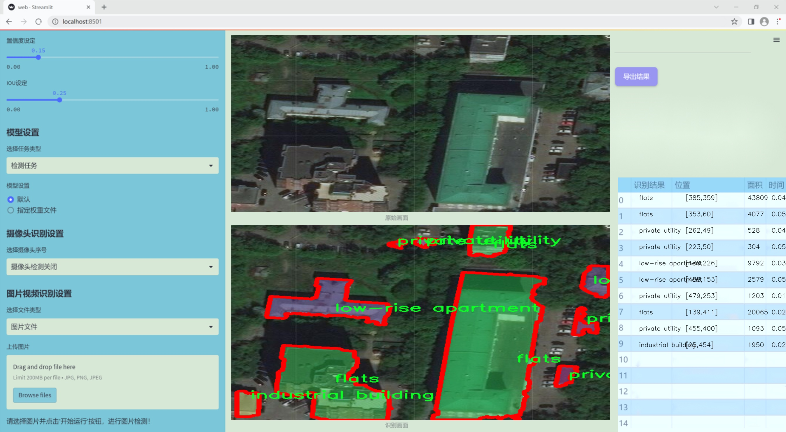
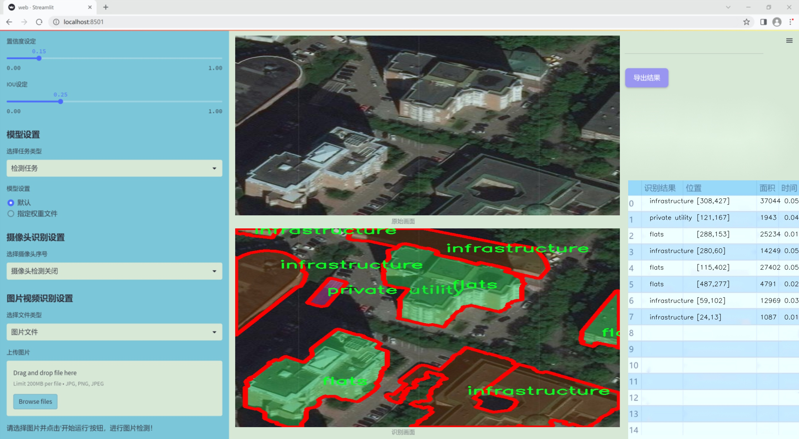
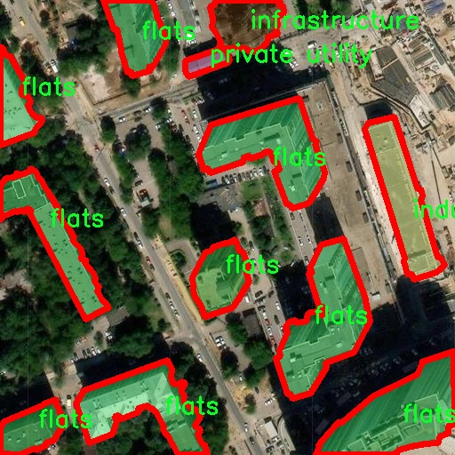
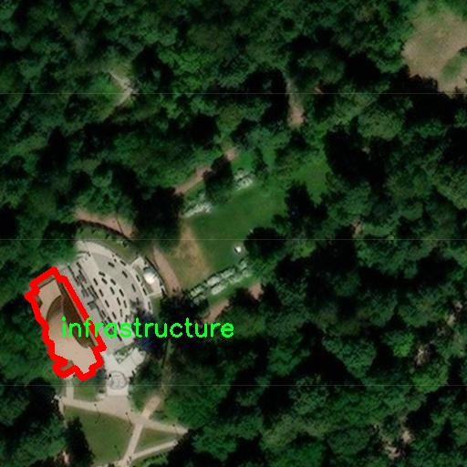
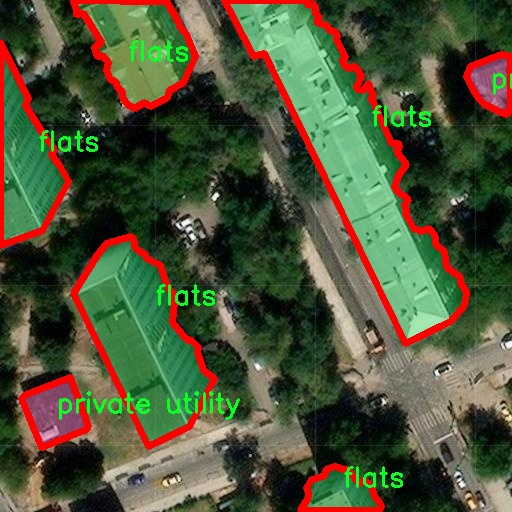
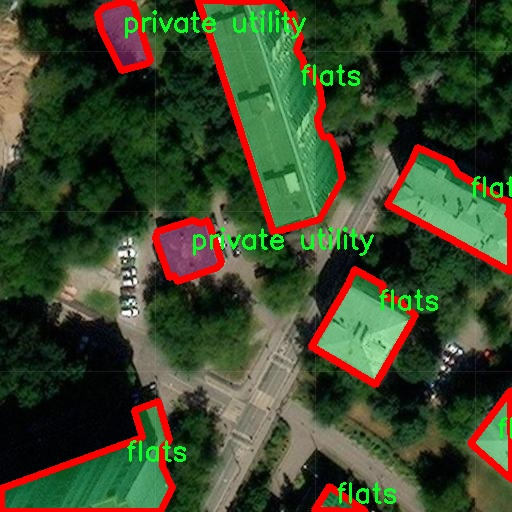
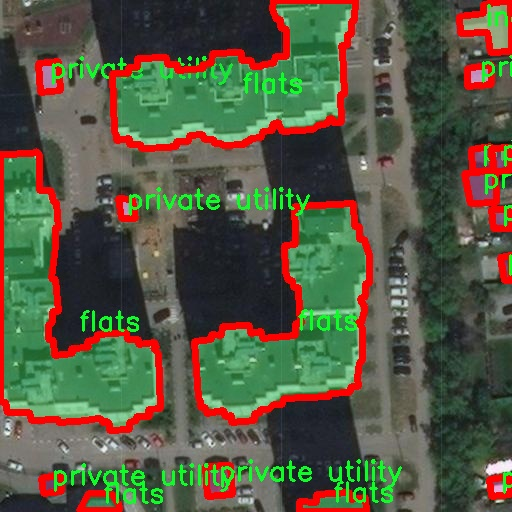

### 1.背景意义

研究背景与意义

随着城市化进程的加快，建筑物的种类和数量不断增加，建筑物的管理与维护也面临着越来越大的挑战。为了有效地进行建筑物的分类与识别，计算机视觉技术逐渐成为一种重要的工具。尤其是在建筑行业，准确识别待施工和完工建筑物的类型，不仅可以提高施工管理的效率，还能为城市规划、资源分配和安全监测提供重要的数据支持。因此，开发一种基于改进YOLOv11的建筑物类型识别图像分割系统，具有重要的现实意义。

本研究所使用的数据集包含七种建筑物类型，包括公寓、工业建筑、基础设施、低层公寓、私人住宅、私人公用设施以及待施工建筑。这些类别的多样性使得系统能够适应不同的应用场景，满足实际需求。通过对124幅图像的标注与分析，我们能够构建一个具有较高准确率和鲁棒性的模型，进而实现对建筑物类型的自动识别与分类。

在当前的研究中，YOLO（You Only Look Once）系列模型因其快速的检测速度和良好的精度而被广泛应用。改进YOLOv11模型将进一步提升建筑物类型识别的性能，使其在实际应用中更加高效。通过引入先进的深度学习技术，我们不仅可以提高模型的识别精度，还能为后续的建筑物监测与管理提供更为精准的数据支持。

综上所述，基于改进YOLOv11的待施工和完工建筑物类型识别图像分割系统的研究，不仅具有重要的学术价值，也对实际的建筑管理和城市发展具有深远的影响。通过该系统的开发与应用，我们期待能够为建筑行业的数字化转型贡献一份力量。

### 2.视频效果

[2.1 视频效果](https://www.bilibili.com/video/BV1xdBaYuEpe/)

### 3.图片效果







##### [项目涉及的源码数据来源链接](https://kdocs.cn/l/cszuIiCKVNis)**

注意：本项目提供训练的数据集和训练教程,由于版本持续更新,暂不提供权重文件（best.pt）,请按照6.训练教程进行训练后实现上图演示的效果。

### 4.数据集信息

##### 4.1 本项目数据集类别数＆类别名

nc: 7
names: ['flats', 'industrial building', 'infrastructure', 'low-rise apartment', 'private house', 'private utility', 'under construction']


该项目为【图像分割】数据集，请在【训练教程和Web端加载模型教程（第三步）】这一步的时候按照【图像分割】部分的教程来训练

##### 4.2 本项目数据集信息介绍

本项目数据集信息介绍

本项目旨在开发一种改进的YOLOv11模型，以实现对待施工和完工建筑物类型的精准识别与图像分割。为此，我们构建了一个专门的数据集，命名为“SBR Instance”，该数据集涵盖了七种建筑物类型，具体包括：公寓（flats）、工业建筑（industrial building）、基础设施（infrastructure）、低层公寓（low-rise apartment）、私人住宅（private house）、私人公用设施（private utility）以及在建建筑（under construction）。这些类别的选择不仅反映了建筑物的多样性，也考虑到了城市发展与基础设施建设的实际需求。

数据集中包含的图像均经过精心挑选，确保其在不同环境、光照条件及角度下的代表性。这些图像来源于多种场景，包括城市、乡村及工业区，旨在为模型提供丰富的训练样本，以增强其泛化能力和识别准确性。每个类别的图像均进行了详细的标注，确保模型在训练过程中能够学习到各类建筑物的特征和细节。这种细致的标注不仅有助于提高模型的性能，也为后续的图像分割任务奠定了坚实的基础。

此外，数据集的构建还考虑到了不同建筑物在实际应用中的重要性。例如，私人住宅和低层公寓在城市居住环境中占据重要地位，而基础设施和工业建筑则是城市发展和经济活动的关键组成部分。通过对这些类别的综合分析与训练，我们期望改进后的YOLOv11模型能够在建筑物类型识别方面表现出色，为智能城市建设和管理提供有效的技术支持。最终，本项目的数据集不仅是一个简单的图像集合，更是推动建筑物识别技术进步的重要资源。











### 5.全套项目环境部署视频教程（零基础手把手教学）

[5.1 所需软件PyCharm和Anaconda安装教程（第一步）](https://www.bilibili.com/video/BV1BoC1YCEKi/?spm_id_from=333.999.0.0&vd_source=bc9aec86d164b67a7004b996143742dc)


[5.2 安装Python虚拟环境创建和依赖库安装视频教程（第二步）](https://www.bilibili.com/video/BV1ZoC1YCEBw?spm_id_from=333.788.videopod.sections&vd_source=bc9aec86d164b67a7004b996143742dc)

### 6.改进YOLOv11训练教程和Web_UI前端加载模型教程（零基础手把手教学）

[6.1 改进YOLOv11训练教程和Web_UI前端加载模型教程（第三步）](https://www.bilibili.com/video/BV1BoC1YCEhR?spm_id_from=333.788.videopod.sections&vd_source=bc9aec86d164b67a7004b996143742dc)


按照上面的训练视频教程链接加载项目提供的数据集，运行train.py即可开始训练



     Epoch   gpu_mem       box       obj       cls    labels  img_size
     1/200     20.8G   0.01576   0.01955  0.007536        22      1280: 100%|██████████| 849/849 [14:42<00:00,  1.04s/it]
               Class     Images     Labels          P          R     mAP@.5 mAP@.5:.95: 100%|██████████| 213/213 [01:14<00:00,  2.87it/s]
                 all       3395      17314      0.994      0.957      0.0957      0.0843

     Epoch   gpu_mem       box       obj       cls    labels  img_size
     2/200     20.8G   0.01578   0.01923  0.007006        22      1280: 100%|██████████| 849/849 [14:44<00:00,  1.04s/it]
               Class     Images     Labels          P          R     mAP@.5 mAP@.5:.95: 100%|██████████| 213/213 [01:12<00:00,  2.95it/s]
                 all       3395      17314      0.996      0.956      0.0957      0.0845

     Epoch   gpu_mem       box       obj       cls    labels  img_size
     3/200     20.8G   0.01561    0.0191  0.006895        27      1280: 100%|██████████| 849/849 [10:56<00:00,  1.29it/s]
               Class     Images     Labels          P          R     mAP@.5 mAP@.5:.95: 100%|███████   | 187/213 [00:52<00:00,  4.04it/s]
                 all       3395      17314      0.996      0.957      0.0957      0.0845


###### [项目数据集下载链接](https://kdocs.cn/l/cszuIiCKVNis)

### 7.原始YOLOv11算法讲解


##### YOLO11介绍

Ultralytics YOLO11是一款尖端的、最先进的模型，它在之前YOLO版本成功的基础上进行了构建，并引入了新功能和改进，以进一步提升性能和灵活性。
**YOLO11设计快速、准确且易于使用，使其成为各种物体检测和跟踪、实例分割、图像分类以及姿态估计任务的绝佳选择。**


**结构图如下：**


##### **C3k2**

**C3k2，结构图如下**


**C3k2，继承自类`C2f，其中通过c3k设置False或者Ture来决定选择使用C3k还是`**Bottleneck


**实现代码** **ultralytics/nn/modules/block.py**

##### C2PSA介绍

**借鉴V10 PSA结构，实现了C2PSA和C2fPSA，最终选择了基于C2的C2PSA（可能涨点更好？）**


**实现代码** **ultralytics/nn/modules/block.py**

##### Detect介绍

**分类检测头引入了DWConv（更加轻量级，为后续二次创新提供了改进点），结构图如下（和V8的区别）：**


### 8.200+种全套改进YOLOV11创新点原理讲解

#### 8.1 200+种全套改进YOLOV11创新点原理讲解大全

由于篇幅限制，每个创新点的具体原理讲解就不全部展开，具体见下列网址中的改进模块对应项目的技术原理博客网址【Blog】（创新点均为模块化搭建，原理适配YOLOv5~YOLOv11等各种版本）

[改进模块技术原理博客【Blog】网址链接](https://gitee.com/qunmasj/good)


#### 8.2 精选部分改进YOLOV11创新点原理讲解

###### 这里节选部分改进创新点展开原理讲解(完整的改进原理见上图和[改进模块技术原理博客链接](https://gitee.com/qunmasj/good)【如果此小节的图加载失败可以通过CSDN或者Github搜索该博客的标题访问原始博客，原始博客图片显示正常】


### Context_Grided_Network(CGNet)简介
参考该博客提出的一种轻量化语义分割模型Context Grided Network(CGNet)，以满足设备的运行需要。

CGNet主要由CG块构建而成，CG块可以学习局部特征和周围环境上下文的联合特征，最后通过引入全局上下文特征进一步改善联合特征的学习。


 
下图给出了在Cityscapes数据集上对现有的一些语义分割模型的测试效果，横轴表示参数量，纵轴表示准确率(mIoU)。可以看出，在参数量较少的情况下，CGNet可以达到一个比较好的准确率。虽与高精度模型相去甚远，但在一些对精度要求不高、对实时性要求比较苛刻的情况下，很有价值。


高精度模型，如DeepLab、DFN、DenseASPP等，动不动就是几十M的参数，很难应用在移动设备上。而上图中红色的模型，相对内存占用较小，但它们的分割精度却不是很高。作者认为主要原因是，这些小网络大多遵循着分类网络的设计思路，并没有考虑语义分割任务更深层次的特点。

空间依赖性和上下文信息对提高分割精度有很大的作用。作者从该角度出发，提出了CG block，并进一步搭建了轻量级语义分割网络CGNet。CG块具有以下特点： 

学习局部特征和上下文特征的联合特征；
通过全局上下文特征改进上述联合特征；
可以贯穿应用在整个网络中，从low level（空间级别）到high level（语义级别）。不像PSPNet、DFN、DenseASPP等，只在编码阶段以后捕捉上下文特征。；
只有3个下采样，相比一般5个下采样的网络，能够更好地保留边缘信息。
CGNet遵循“深而薄”的原则设计，整个网络又51层构成。其中，为了降低计算，大量使用了channel-wise conv.

小型语义分割模型：

需要平衡准确率和系统开销
进化路线：ENet -> ICNet -> ESPNet
这些模型基本都基于分类网络设计，在分割准确率上效果并不是很好
上下文信息模型：

大多数现有模型只考虑解码阶段的上下文信息并且没有利用周围的上下文信息
注意力机制：

CG block使用全局上下文信息计算权重向量，并使用其细化局部特征和周围上下文特征的联合特征

#### Context Guided Block
CG block由4部分组成：


此外，CG block还采用了残差学习。文中提出了局部残差学习（LRL）和全局残差学习（GRL）两种方式。 LRL添加了从输入到联合特征提取器的连接，GRL添加了从输入到全局特征提取器的连接。从直观上来说，GRL比LRL更能促进网络中的信息传递（更像ResNet~~），后面实验部分也进行了测试，的确GRL更能提升分割精度。


CGNet的通用网络结构如下图所示，分为3个stage，第一个stage使用3个卷积层抽取特征，第二和第三个stage堆叠一定数量的CG block，具体个数可以根据情况调整。最后，通过1x1 conv得到分割结果。


下图是用于Cityscapes数据集的CGNet网络细节说明：输入尺寸为3*680*680；stage1连续使用了3个Conv-BN-PReLU组合，首个组合使用了stride=2的卷积，所以得到了1/2分辨率的feature map；stage2和stage3分别使用了多个CG block，且其中使用了不同大小的膨胀卷积核，最终分别得到了1/4和1/8的feature map。

需注意：

stage2&3的输入特征分别由其上一个stage的首个和最后一个block组合给出（参考上图的绿色箭头）；

输入注入机制，图中未体现，实际使用中，作者还将输入图像下采样1/4或1/8，分别给到stage2和stage3的输入中 ，以进一步加强特征传递。

channel-wise conv。为了缩减参数数量，在局部特征提取器和周围上下文特征提取器中使用了channel-wise卷积，可以消除跨通道的计算成本，同时节省内存占用。但是，没有像MobileNet等模型一样，在depth-wise卷积后面接point-wise卷积（1*1 conv），作者解释是，因为CG block需要保持局部特征和周围上下文特征的独立性，而1*1 conv会破坏这种独立性，所以效果欠佳，实验部分也进行了验证。

个人感觉此处应该指的是depth-wise卷积？

官方Git中对该部分的实现如下：


### 9.系统功能展示

图9.1.系统支持检测结果表格显示

  图9.2.系统支持置信度和IOU阈值手动调节

  图9.3.系统支持自定义加载权重文件best.pt(需要你通过步骤5中训练获得)

  图9.4.系统支持摄像头实时识别

  图9.5.系统支持图片识别

  图9.6.系统支持视频识别

  图9.7.系统支持识别结果文件自动保存

  图9.8.系统支持Excel导出检测结果数据


### 10. YOLOv11核心改进源码讲解

#### 10.1 cfpt.py

下面是对代码中最核心部分的分析和详细中文注释。我们将保留关键的类和方法，去掉冗余的部分。

```python
import torch
import math
import torch.nn as nn
import torch.nn.functional as F

class CrossLayerPosEmbedding3D(nn.Module):
    def __init__(self, num_heads=4, window_size=(5, 3, 1), spatial=True):
        super(CrossLayerPosEmbedding3D, self).__init__()
        self.spatial = spatial  # 是否使用空间位置嵌入
        self.num_heads = num_heads  # 注意力头的数量
        self.layer_num = len(window_size)  # 层数
        # 初始化相对位置偏置表
        self.relative_position_bias_table = nn.Parameter(torch.zeros((2 * window_size[0] - 1) * (2 * window_size[0] - 1), num_heads))
        # 计算相对位置索引
        self.register_buffer("relative_position_index", self.compute_relative_position_index(window_size))

    def compute_relative_position_index(self, window_size):
        # 计算相对位置索引
        coords_h = [torch.arange(ws) - ws // 2 for ws in window_size]
        coords_w = [torch.arange(ws) - ws // 2 for ws in window_size]
        coords_flatten = torch.cat([torch.flatten(coord) for coord in coords_h + coords_w], dim=-1)
        relative_coords = coords_flatten[:, :, None] - coords_flatten[:, None, :]
        relative_coords = relative_coords.permute(1, 2, 0).contiguous()
        relative_coords[:, :, 0] += window_size[0] - 1
        relative_coords[:, :, 1] += window_size[0] - 1
        relative_coords[:, :, 0] *= 2 * window_size[0] - 1
        return relative_coords.sum(-1)

    def forward(self):
        # 计算位置嵌入
        pos_indicies = self.relative_position_index.view(-1)
        pos_embed = self.relative_position_bias_table[pos_indicies.long()]
        return pos_embed

class CrossLayerSpatialAttention(nn.Module):
    def __init__(self, in_dim, layer_num=3, num_heads=4):
        super(CrossLayerSpatialAttention, self).__init__()
        self.num_heads = num_heads
        self.hidden_dim = in_dim // 4  # 降维
        self.qkv = nn.Conv2d(in_dim, self.hidden_dim * 3, kernel_size=1)  # Q, K, V的线性变换
        self.softmax = nn.Softmax(dim=-1)  # Softmax层
        self.pos_embed = CrossLayerPosEmbedding3D(num_heads=num_heads)  # 位置嵌入

    def forward(self, x_list):
        q_list, k_list, v_list = [], [], []
        for x in x_list:
            qkv = self.qkv(x)  # 计算Q, K, V
            q, k, v = qkv.chunk(3, dim=1)  # 分割Q, K, V
            q_list.append(q)
            k_list.append(k)
            v_list.append(v)

        # 将Q, K, V堆叠在一起
        q_stack = torch.cat(q_list, dim=1)
        k_stack = torch.cat(k_list, dim=1)
        v_stack = torch.cat(v_list, dim=1)

        # 计算注意力
        attn = F.normalize(q_stack, dim=-1) @ F.normalize(k_stack, dim=-1).transpose(-1, -2)
        attn = attn + self.pos_embed()  # 加上位置嵌入
        attn = self.softmax(attn)  # 应用Softmax

        # 计算输出
        out = attn @ v_stack
        return out

class CrossLayerChannelAttention(nn.Module):
    def __init__(self, in_dim, layer_num=3, num_heads=4):
        super(CrossLayerChannelAttention, self).__init__()
        self.num_heads = num_heads
        self.hidden_dim = in_dim // 4  # 降维
        self.qkv = nn.Conv2d(in_dim, self.hidden_dim * 3, kernel_size=1)  # Q, K, V的线性变换
        self.softmax = nn.Softmax(dim=-1)  # Softmax层
        self.pos_embed = CrossLayerPosEmbedding3D(num_heads=num_heads, spatial=False)  # 位置嵌入

    def forward(self, x_list):
        q_list, k_list, v_list = [], [], []
        for x in x_list:
            qkv = self.qkv(x)  # 计算Q, K, V
            q, k, v = qkv.chunk(3, dim=1)  # 分割Q, K, V
            q_list.append(q)
            k_list.append(k)
            v_list.append(v)

        # 将Q, K, V堆叠在一起
        q_stack = torch.cat(q_list, dim=1)
        k_stack = torch.cat(k_list, dim=1)
        v_stack = torch.cat(v_list, dim=1)

        # 计算注意力
        attn = F.normalize(q_stack, dim=-1) @ F.normalize(k_stack, dim=-1).transpose(-1, -2)
        attn = attn + self.pos_embed()  # 加上位置嵌入
        attn = self.softmax(attn)  # 应用Softmax

        # 计算输出
        out = attn @ v_stack
        return out
```

### 代码核心部分说明：
1. **CrossLayerPosEmbedding3D**: 这个类负责计算跨层的位置信息嵌入。它使用相对位置偏置来增强模型对输入空间结构的理解。

2. **CrossLayerSpatialAttention**: 这个类实现了空间注意力机制。它通过计算Q、K、V来获得输入特征的注意力分布，并结合位置嵌入进行加权。

3. **CrossLayerChannelAttention**: 这个类实现了通道注意力机制，类似于空间注意力，但在通道维度上进行操作。它也计算Q、K、V，并应用位置嵌入。

这些核心部分是实现跨层注意力机制的基础，能够有效地捕捉输入特征之间的关系。

该程序文件 `cfpt.py` 实现了一个深度学习模型的部分，主要用于图像处理任务，包含了多种注意力机制和位置编码的实现。以下是对文件中各个部分的详细讲解。

首先，文件导入了一些必要的库，包括 PyTorch、数学运算、Einops（用于张量重排）、以及一些深度学习相关的模块。接着，定义了两个主要的类：`CrossLayerChannelAttention` 和 `CrossLayerSpatialAttention`，这两个类实现了跨层的通道注意力和空间注意力机制。

`LayerNormProxy` 类是一个简单的层归一化实现，它重排输入张量的维度，以适应 PyTorch 的 `LayerNorm` 操作。这个类在后续的模型中被多次使用，以确保输入数据的标准化。

`CrossLayerPosEmbedding3D` 类用于生成跨层的三维位置嵌入。它根据给定的窗口大小和头数，计算相对位置偏置，并将其存储为可训练的参数。该类的 `forward` 方法计算位置嵌入，并返回适合不同层的嵌入。

`ConvPosEnc` 类实现了卷积位置编码，它通过卷积操作对输入特征进行处理，并可选择性地应用激活函数。`DWConv` 类实现了深度可分离卷积，用于处理输入特征图。

`Mlp` 类是一个简单的多层感知机，包含两个线性层和一个激活函数，主要用于特征的非线性变换。

接下来，文件中定义了一些辅助函数，例如 `overlaped_window_partition` 和 `overlaped_window_reverse`，这些函数用于在窗口划分和重组时处理输入张量，支持重叠窗口的操作。这些函数对于实现注意力机制中的窗口划分至关重要。

`CrossLayerSpatialAttention` 类实现了空间注意力机制。它接收多个层的输入，通过卷积和注意力机制对特征进行处理。该类的 `forward` 方法中，首先对每一层的输入进行卷积位置编码，然后计算查询、键、值，接着通过注意力机制生成输出。最后，输出经过归一化和多层感知机处理后返回。

`CrossLayerChannelAttention` 类实现了通道注意力机制，结构与空间注意力类似，但在处理方式上有所不同。它使用了像素下采样和上采样操作，以便在不同层之间传递信息。该类同样在 `forward` 方法中处理输入，计算注意力，并返回经过处理的特征。

整体来看，该文件实现了一个复杂的深度学习模型，结合了多种注意力机制和位置编码方式，旨在提高图像处理任务中的特征提取能力。通过跨层的信息交互和注意力机制，模型能够更好地捕捉图像中的空间和通道特征，从而提升性能。

#### 10.2 predict.py

以下是代码中最核心的部分，并附上详细的中文注释：

```python
from ultralytics.engine.predictor import BasePredictor
from ultralytics.engine.results import Results
from ultralytics.utils import ops

class DetectionPredictor(BasePredictor):
    """
    DetectionPredictor类扩展了BasePredictor类，用于基于检测模型进行预测。
    """

    def postprocess(self, preds, img, orig_imgs):
        """
        对预测结果进行后处理，并返回Results对象的列表。

        参数:
        preds: 模型的预测结果
        img: 输入图像
        orig_imgs: 原始图像列表

        返回:
        results: 包含后处理结果的Results对象列表
        """
        # 应用非极大值抑制（NMS）来过滤预测框
        preds = ops.non_max_suppression(
            preds,
            self.args.conf,  # 置信度阈值
            self.args.iou,   # IOU阈值
            agnostic=self.args.agnostic_nms,  # 是否使用类别无关的NMS
            max_det=self.args.max_det,  # 最大检测框数量
            classes=self.args.classes,   # 需要检测的类别
        )

        # 如果输入的原始图像不是列表，则将其转换为numpy数组
        if not isinstance(orig_imgs, list):  # 输入图像是torch.Tensor，而不是列表
            orig_imgs = ops.convert_torch2numpy_batch(orig_imgs)

        results = []  # 初始化结果列表
        for i, pred in enumerate(preds):  # 遍历每个预测结果
            orig_img = orig_imgs[i]  # 获取对应的原始图像
            # 将预测框的坐标从缩放后的图像空间转换回原始图像空间
            pred[:, :4] = ops.scale_boxes(img.shape[2:], pred[:, :4], orig_img.shape)
            img_path = self.batch[0][i]  # 获取图像路径
            # 创建Results对象并添加到结果列表中
            results.append(Results(orig_img, path=img_path, names=self.model.names, boxes=pred))
        
        return results  # 返回包含所有结果的列表
```

### 代码核心部分说明：
1. **类定义**：`DetectionPredictor`类继承自`BasePredictor`，用于实现基于检测模型的预测功能。
2. **后处理方法**：`postprocess`方法负责对模型的预测结果进行后处理，包括应用非极大值抑制（NMS）来过滤掉冗余的检测框，并将框的坐标从缩放后的图像空间转换回原始图像空间。
3. **结果收集**：该方法将处理后的结果封装为`Results`对象，并返回一个包含所有结果的列表。

这个程序文件 `predict.py` 是一个用于目标检测的预测模块，继承自 `BasePredictor` 类，主要用于处理基于 YOLO（You Only Look Once）模型的预测任务。文件中包含了一个名为 `DetectionPredictor` 的类，专门用于进行目标检测的预测。

在这个类的文档字符串中，提供了一个使用示例，展示了如何导入必要的模块并创建 `DetectionPredictor` 的实例。用户可以通过传入模型路径和数据源来初始化预测器，并调用 `predict_cli()` 方法进行预测。

类中的 `postprocess` 方法负责对模型的预测结果进行后处理。首先，它调用 `ops.non_max_suppression` 函数来执行非极大值抑制，这是一种常用的技术，用于去除重叠的检测框，以保留最有可能的目标检测结果。该方法的参数包括置信度阈值、IOU（Intersection over Union）阈值、是否使用类别无关的 NMS、最大检测数量以及要检测的类别。

接下来，方法检查输入的原始图像是否为列表格式。如果不是，则将其转换为 NumPy 数组格式，以便后续处理。然后，程序会遍历每个预测结果，调整检测框的坐标，以适应原始图像的尺寸，并将每个检测结果封装成 `Results` 对象。每个 `Results` 对象包含了原始图像、图像路径、模型名称和检测框信息，最终返回一个包含所有结果的列表。

整体来看，这个文件实现了目标检测模型的预测功能，并对预测结果进行了有效的后处理，以便于后续的使用和分析。

#### 10.3 shiftwise_conv.py

以下是经过简化并注释的核心代码部分，主要保留了 `ReparamLargeKernelConv` 类及其相关功能。

```python
import math
import torch
import torch.nn as nn
import torch.nn.functional as F

def get_conv2d(in_channels, out_channels, kernel_size, stride, padding, dilation, groups, bias):
    """创建一个2D卷积层"""
    return nn.Conv2d(
        in_channels, out_channels, kernel_size, stride, padding, dilation, groups, bias
    )

def get_bn(channels):
    """创建一个批归一化层"""
    return nn.BatchNorm2d(channels)

class ReparamLargeKernelConv(nn.Module):
    def __init__(self, in_channels, out_channels, kernel_size, small_kernel=5, stride=1, groups=1, small_kernel_merged=False, Decom=True, bn=True):
        super(ReparamLargeKernelConv, self).__init__()
        self.kernel_size = kernel_size  # 大卷积核的大小
        self.small_kernel = small_kernel  # 小卷积核的大小
        self.Decom = Decom  # 是否使用分解
        padding = kernel_size // 2  # 填充大小

        # 如果小卷积核合并，直接创建一个卷积层
        if small_kernel_merged:
            self.lkb_reparam = get_conv2d(
                in_channels=in_channels,
                out_channels=out_channels,
                kernel_size=kernel_size,
                stride=stride,
                padding=padding,
                dilation=1,
                groups=groups,
                bias=True,
            )
        else:
            # 根据是否分解选择不同的卷积结构
            if self.Decom:
                self.LoRA = conv_bn(
                    in_channels=in_channels,
                    out_channels=out_channels,
                    kernel_size=(kernel_size, small_kernel),
                    stride=stride,
                    padding=padding,
                    groups=groups,
                    bn=bn
                )
            else:
                self.lkb_origin = conv_bn(
                    in_channels=in_channels,
                    out_channels=out_channels,
                    kernel_size=kernel_size,
                    stride=stride,
                    padding=padding,
                    groups=groups,
                    bn=bn,
                )

            # 如果小卷积核小于大卷积核，创建小卷积层
            if (small_kernel is not None) and small_kernel < kernel_size:
                self.small_conv = conv_bn(
                    in_channels=in_channels,
                    out_channels=out_channels,
                    kernel_size=small_kernel,
                    stride=stride,
                    padding=small_kernel // 2,
                    groups=groups,
                    bn=bn,
                )
        
        self.bn = get_bn(out_channels)  # 批归一化层
        self.act = nn.SiLU()  # 激活函数

    def forward(self, inputs):
        """前向传播"""
        if hasattr(self, "lkb_reparam"):
            out = self.lkb_reparam(inputs)  # 使用重参数化卷积
        elif self.Decom:
            out = self.LoRA(inputs)  # 使用分解卷积
            if hasattr(self, "small_conv"):
                out += self.small_conv(inputs)  # 加上小卷积的输出
        else:
            out = self.lkb_origin(inputs)  # 使用原始卷积
            if hasattr(self, "small_conv"):
                out += self.small_conv(inputs)  # 加上小卷积的输出
        return self.act(self.bn(out))  # 经过批归一化和激活函数的输出

    def get_equivalent_kernel_bias(self):
        """获取等效的卷积核和偏置"""
        eq_k, eq_b = fuse_bn(self.lkb_origin.conv, self.lkb_origin.bn)  # 融合卷积和批归一化
        if hasattr(self, "small_conv"):
            small_k, small_b = fuse_bn(self.small_conv.conv, self.small_conv.bn)
            eq_b += small_b  # 加上小卷积的偏置
            eq_k += nn.functional.pad(small_k, [(self.kernel_size - self.small_kernel) // 2] * 4)  # 填充小卷积核
        return eq_k, eq_b

    def switch_to_deploy(self):
        """切换到部署模式"""
        if hasattr(self, 'lkb_origin'):
            eq_k, eq_b = self.get_equivalent_kernel_bias()  # 获取等效卷积核和偏置
            self.lkb_reparam = get_conv2d(
                in_channels=self.lkb_origin.conv.in_channels,
                out_channels=self.lkb_origin.conv.out_channels,
                kernel_size=self.lkb_origin.conv.kernel_size,
                stride=self.lkb_origin.conv.stride,
                padding=self.lkb_origin.conv.padding,
                dilation=self.lkb_origin.conv.dilation,
                groups=self.lkb_origin.conv.groups,
                bias=True,
            )
            self.lkb_reparam.weight.data = eq_k  # 设置卷积核
            self.lkb_reparam.bias.data = eq_b  # 设置偏置
            self.__delattr__("lkb_origin")  # 删除原始卷积属性
            if hasattr(self, "small_conv"):
                self.__delattr__("small_conv")  # 删除小卷积属性
```

### 代码注释说明
1. **get_conv2d** 和 **get_bn** 函数用于创建卷积层和批归一化层。
2. **ReparamLargeKernelConv** 类实现了一个重参数化的大卷积核卷积层，支持小卷积核的合并和分解。
3. **forward** 方法定义了前向传播的逻辑，支持不同的卷积结构。
4. **get_equivalent_kernel_bias** 方法用于获取等效的卷积核和偏置，方便在模型部署时使用。
5. **switch_to_deploy** 方法用于切换到部署模式，减少模型的复杂性和计算量。

这个程序文件 `shiftwise_conv.py` 定义了一个用于深度学习卷积操作的模块，主要包括了一个名为 `ReparamLargeKernelConv` 的类。该类的设计旨在实现大卷积核的重参数化，并结合小卷积核的特性，以提高卷积操作的效率和灵活性。

首先，文件导入了必要的库，包括 `math`、`torch` 及其子模块 `torch.nn` 和 `torch.nn.functional`。接着，定义了一些辅助函数，如 `get_conv2d` 和 `get_bn`，分别用于创建卷积层和批归一化层。

`Mask` 类是一个自定义的模块，用于生成一个可学习的掩码，通过对输入进行加权来实现特定的功能。`conv_bn_ori` 函数则是一个组合函数，用于创建一个包含卷积层和可选的批归一化层的序列。

`LoRAConvsByWeight` 类实现了一种新的卷积结构，允许通过权重来对通道进行混合，并通过两个不同大小的卷积核来处理输入数据。该类的 `forward` 方法将输入分为两个部分，分别经过两个不同的掩码处理，并将结果相加。

`conv_bn` 函数根据输入的卷积核大小决定使用哪种卷积结构。如果卷积核大小相同，则调用 `conv_bn_ori`；如果是两个不同的卷积核，则调用 `LoRAConvsByWeight`。

`fuse_bn` 函数用于将卷积层和批归一化层融合，以便在推理阶段减少计算量和内存占用。

`ReparamLargeKernelConv` 类是整个文件的核心，支持大卷积核的重参数化。构造函数中根据输入参数初始化卷积层、批归一化层和激活函数。`forward` 方法根据是否使用重参数化的卷积层或小卷积层来计算输出。

此外，`get_equivalent_kernel_bias` 方法用于获取等效的卷积核和偏置，`switch_to_deploy` 方法则在模型部署时进行必要的转换，将原始卷积层替换为重参数化的卷积层，以提高推理效率。

整体来看，这个文件实现了一种灵活的卷积操作结构，结合了大卷积核和小卷积核的优点，适用于深度学习模型的构建与优化。

#### 10.4 FreqFusion.py

以下是代码中最核心的部分，并附上详细的中文注释：

```python
import torch
import torch.nn as nn
import torch.nn.functional as F

class FreqFusion(nn.Module):
    def __init__(self, channels, scale_factor=1, lowpass_kernel=5, highpass_kernel=3, **kwargs):
        super().__init__()
        hr_channels, lr_channels = channels
        self.scale_factor = scale_factor
        self.lowpass_kernel = lowpass_kernel
        self.highpass_kernel = highpass_kernel
        
        # 压缩高分辨率和低分辨率特征通道
        self.compressed_channels = (hr_channels + lr_channels) // 8
        self.hr_channel_compressor = nn.Conv2d(hr_channels, self.compressed_channels, 1)
        self.lr_channel_compressor = nn.Conv2d(lr_channels, self.compressed_channels, 1)
        
        # 内容编码器，用于生成低通滤波器
        self.content_encoder = nn.Conv2d(
            self.compressed_channels,
            lowpass_kernel ** 2 * self.scale_factor * self.scale_factor,
            kernel_size=3,
            padding=1
        )
        
        # 高通滤波器的内容编码器
        self.content_encoder2 = nn.Conv2d(
            self.compressed_channels,
            highpass_kernel ** 2 * self.scale_factor * self.scale_factor,
            kernel_size=3,
            padding=1
        )

    def kernel_normalizer(self, mask, kernel):
        """
        归一化卷积核
        """
        n, mask_c, h, w = mask.size()
        mask_channel = int(mask_c / float(kernel**2))
        
        # 将mask调整为适合softmax的形状
        mask = mask.view(n, mask_channel, -1, h, w)
        mask = F.softmax(mask, dim=2)
        mask = mask.view(n, mask_channel, kernel, kernel, h, w)
        mask = mask.permute(0, 1, 4, 5, 2, 3).view(n, -1, kernel, kernel)
        
        # 归一化
        mask /= mask.sum(dim=(-1, -2), keepdims=True)
        return mask

    def forward(self, x):
        """
        前向传播
        """
        hr_feat, lr_feat = x
        
        # 压缩特征
        compressed_hr_feat = self.hr_channel_compressor(hr_feat)
        compressed_lr_feat = self.lr_channel_compressor(lr_feat)
        
        # 生成低通和高通滤波器
        mask_lr = self.content_encoder(compressed_hr_feat)
        mask_hr = self.content_encoder2(compressed_hr_feat)
        
        # 归一化滤波器
        mask_lr = self.kernel_normalizer(mask_lr, self.lowpass_kernel)
        mask_hr = self.kernel_normalizer(mask_hr, self.highpass_kernel)
        
        # 使用低通滤波器对低分辨率特征进行处理
        lr_feat = F.conv2d(lr_feat, mask_lr)
        
        # 使用高通滤波器对高分辨率特征进行处理
        hr_feat = hr_feat - F.conv2d(hr_feat, mask_hr)
        
        return hr_feat + lr_feat  # 返回融合后的特征

# 示例用法
# freq_fusion = FreqFusion(channels=(64, 32))
# output = freq_fusion((high_res_input, low_res_input))
```

### 代码说明：
1. **FreqFusion类**：这是一个用于频率感知特征融合的神经网络模块，主要用于处理高分辨率和低分辨率图像特征。
2. **初始化方法**：初始化网络参数，包括高分辨率和低分辨率特征的通道压缩，以及用于生成低通和高通滤波器的卷积层。
3. **kernel_normalizer方法**：用于归一化卷积核，以确保在进行卷积操作时，输出的特征不会因为卷积核的大小而失去信息。
4. **forward方法**：实现前向传播，接收高分辨率和低分辨率特征，生成低通和高通滤波器，并对输入特征进行处理，最后返回融合后的特征。

这个简化版本保留了核心功能和结构，同时提供了必要的注释以帮助理解代码的工作原理。

这个程序文件 `FreqFusion.py` 实现了一种频率感知特征融合的方法，主要用于密集图像预测任务。程序使用了 PyTorch 框架，包含了多个类和函数，以下是对代码的详细说明。

首先，文件导入了必要的库，包括 PyTorch 的核心库、神经网络模块、功能模块以及一些工具函数。此外，还尝试从 `mmcv` 库中导入一些操作函数，如果导入失败则会被忽略。

文件中定义了一些初始化函数，如 `normal_init` 和 `constant_init`，用于对神经网络层的权重和偏置进行初始化。`resize` 函数用于调整输入张量的大小，支持多种插值模式，并在某些情况下发出警告。

`hamming2D` 函数生成一个二维的 Hamming 窗，通常用于信号处理中的窗口函数，以减少频谱泄漏。

接下来，定义了 `FreqFusion` 类，这是整个程序的核心。构造函数中接受多个参数，包括通道数、缩放因子、低通和高通卷积核大小等。类内部创建了多个卷积层，用于特征压缩和内容编码。根据参数设置，可能会使用高通和低通滤波器来处理输入特征。

`init_weights` 方法初始化网络中所有卷积层的权重，使用 Xavier 初始化和正态分布初始化。`kernel_normalizer` 方法用于对卷积核进行归一化处理，确保其和为1。

`forward` 方法是网络的前向传播函数，根据输入的高分辨率和低分辨率特征进行融合。如果启用了检查点功能，则使用 PyTorch 的检查点机制来节省内存。

`_forward` 方法实现了具体的特征融合逻辑。首先对高分辨率和低分辨率特征进行压缩，然后根据不同的参数设置选择不同的融合策略。通过卷积操作生成高通和低通掩码，并使用这些掩码对特征进行处理。最后，将处理后的高分辨率和低分辨率特征相加，得到最终的输出。

此外，文件中还定义了 `LocalSimGuidedSampler` 类，这是一个用于生成偏移量的模块，支持局部相似性引导的采样。该类通过计算输入特征的相似性来生成偏移量，从而实现更精细的特征重采样。

最后，`compute_similarity` 函数用于计算输入张量中每个点与其周围点的余弦相似度，帮助在特征融合过程中进行相似性计算。

整体而言，这个程序文件实现了一种复杂的特征融合机制，结合了频率域的处理方法，旨在提高图像预测的精度和效果。

### 11.完整训练+Web前端界面+200+种全套创新点源码、数据集获取


# [下载链接：https://mbd.pub/o/bread/Z5ibmZZq](https://mbd.pub/o/bread/Z5ibmZZq)